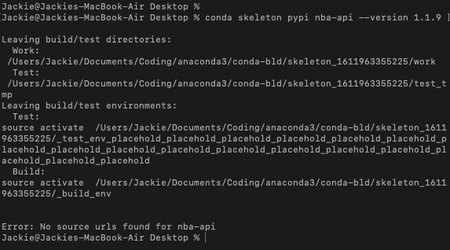
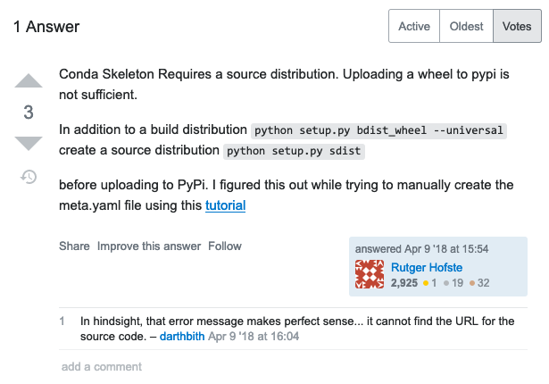
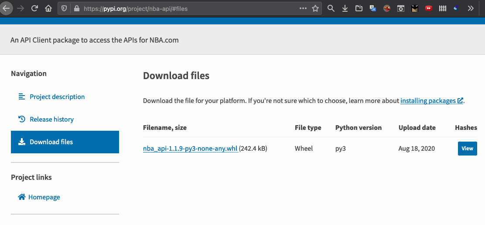
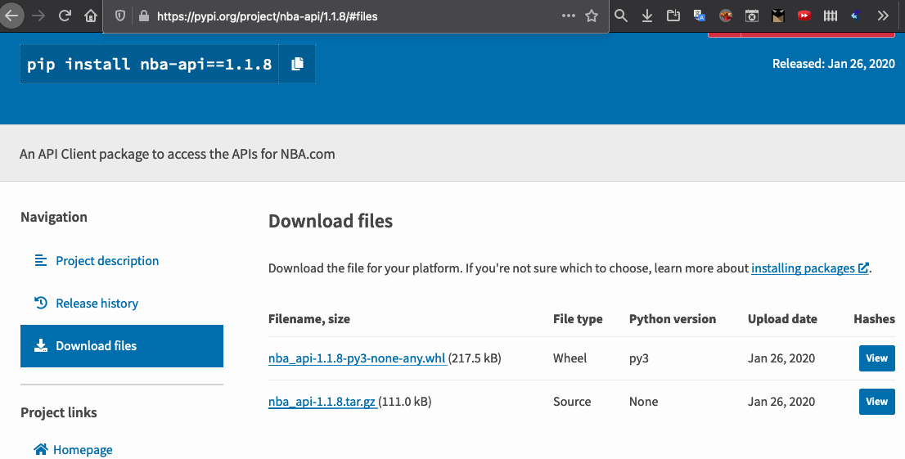
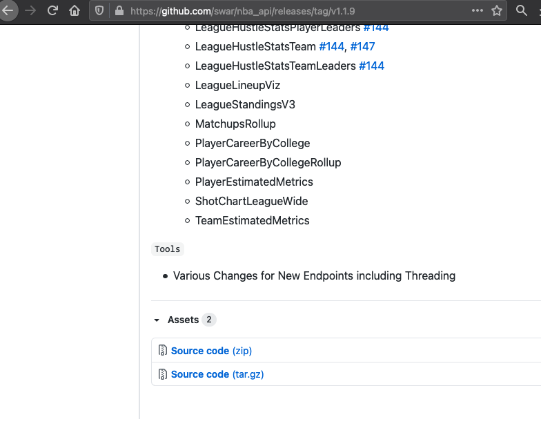
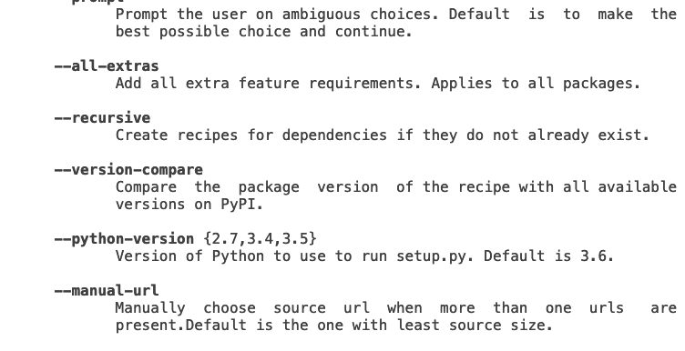

<head>
  <!-- style sheet -->
  
</head>

<!-- omit in toc -->
# Conda environments, PyPI packages, and Jupyter Notebooks
<!-- omit in toc -->
## Author: Jackie Lu
<!-- omit in toc -->
## Date: 2021, Mar. 13
 

<section class="footer">
  

    <a href="https://jql6.github.io/">
      Return to homepage
    </a>
  

</section>

<!-- omit in toc -->
## Table of Contents
- [Intro](#intro)
- [Creating the Conda environment and installing the PyPI package](#creating-the-conda-environment-and-installing-the-pypi-package)
- [Importing the environment into a Jupyter Notebook kernel](#importing-the-environment-into-a-jupyter-notebook-kernel)
- [Summary](#summary)
- [Resources](#resources)

 

# Intro
I'll be dicussing how to create a new Conda environment, install a package from PyPI into here, and use the new Conda environment in Jupyter Notebook. We will do this with an environment containing the [`nba_api` Python package written by Swar](https://github.com/swar/nba_api).

["A conda environment is a directory that contains a specific collection of conda packages that you have installed."][1] It will contain the packages that you have chosen to install for the environment; this way if you want to work on different projects that require two different versions of the same package, you can swap environments instead of changing all of the packages to make it work.

I'm covering how to install packages from PyPI because there may be packages on here that you want to use that aren't installed as easily as packages from a standard Conda site such as Conda-Forge.

["A notebook kernel is a “computational engine” that executes the code contained in a Notebook document."][2] We have to manually import the Conda environment into the kernel to be able to use the Conda environment in Jupyter Notebook.

# Creating the Conda environment and installing the PyPI package
We can create a Conda environment with the name "nba_api_env" like so:
> `conda create --name nba_api_env`

 

Here are some other Conda commands that you may find helpful:
looking at the list of Conda environments you have and which environment you're currently in:
> `conda env list`

switching into a Conda environment you already have:
> `conda activate nba_api_env`

switching into base Conda:
> `conda activate`

deleting a Conda environment:
> `conda remove --name nba_api_env --all`

 

We will have to install the `nba_api` Python package from PyPI, the Python Package Index. We can use [asmeurer's guide][3] to do this.

These are the commands from asmeurer's answer:
> `conda skeleton pypi package`

> `conda build package`

> `conda activate nba_api_env`

> `conda install --use-local package`

Where `package` is the name of the package that you want to install from PyPi.

I tried using the skeleton command but it didn't work. I got this error:
<section>
    
</section>
 

I then found this answer about this error from [Rutger Hofste][4]:
<section>
    
</section>
 

This led me to check [nba-api's package on the PyPI website](https://pypi.org/project/nba-api/1.1.9/#files) which shows that there is no row with the file type 'Source':
<section>
    
</section>
 

compared to the [previous version of nba-api](https://pypi.org/project/nba-api/1.1.8/#files) that has this.
<section>
    
</section>
 

Therefore I went to the [github repo release for the nba-api package](https://github.com/swar/nba_api/releases/tag/v1.1.9) and located the source file.
<section>
    
</section>
 

I will now attempt to use the `--manual-url` parameter shown on [Conda's skeleton function documentation page](https://docs.conda.io/projects/conda-build/en/latest/resources/commands/conda-skeleton-pypi.html) and supply it with the link to the source file.
<section>
    
</section>
 

It looks like `--manual-url` is just used to manually select a url after the command has finished; you can supply a source url for it. I've submitted a question in the NBA API slack's help channel to see if I would be able to get an answer.

 

UPDATE: I ended up using the older version 1.1.8 that had the source code.

This means instead of using the standard PyPI skeleton line:
> `conda skeleton pypi package`

I used this instead:
> `conda skeleton pypi package --version 1.1.8`

# Importing the environment into a Jupyter Notebook kernel
Now that you have the NBA python package installed in your new Conda environment, you may run into a new issue when using Jupyter Notebook. If you try to open a new file in Jupyter Notebook and select `Kernel > Change kernel`, you'll see that you can't the new environment. This is because Jupyter Notebook doesn't use your normal Conda and instead uses kernels, which are like their own instance of Python.

To fix this, you'll need to make a kernel for your new Conda environment.

> `conda create activate nba_api_env`
 
> `conda install nb_conda_kernels`

> `python -m ipykernel install --user --name nba_api_env --display-name "Python (nba_api_env)"`

As a side note, you can use this to remove a kernel:
> `jupyter kernelspec uninstall unwanted-kernel`

Once you're done adding this kernel, you'll finally be able to use your new environment in Jupyter Notebook with packages from PyPI!

# Summary

> `conda create --name nba_api_env`

# Resources
[1]: <https://docs.conda.io/projects/conda/en/latest/user-guide/concepts/environments.html> "Conda environments"

1. **Conda environments**
 
https://docs.conda.io/projects/conda/en/latest/user-guide/concepts/environments.html
 

[2]: <https://jupyter-notebook-beginner-guide.readthedocs.io/en/latest/what_is_jupyter.html#kernel> "Jupyter Notebook kernels"

2. **What is the Jupyter Notebook?**
 
https://jupyter-notebook-beginner-guide.readthedocs.io/en/latest/what_is_jupyter.html#kernel

[3]: <https://stackoverflow.com/a/29304731> "asmeurer's guide on installing PyPi packages into Conda"

3. **asmeurer on 'How to install PyPi packages using anaconda conda command'**
 
https://stackoverflow.com/a/29304731
 
I used this answer to help us install packages to Conda environments from PyPi.

[4]: <https://stackoverflow.com/a/49736986> "Rutger Hofste's reply on source code error message from conda skeleton"

4. **Rutger Hofste on 'Conda Skeleton Fails'**
 
https://stackoverflow.com/a/49736986
 

[5]: <https://stackoverflow.com/questions/39604271/conda-environments-not-showing-up-in-jupyter-notebook> "Installing kernels for Conda environments"

5. **Installing kernels for Conda environments**
 
https://stackoverflow.com/questions/39604271/conda-environments-not-showing-up-in-jupyter-notebook
 
I used this answer to handle the error I got from running the `conda skeleton` command.