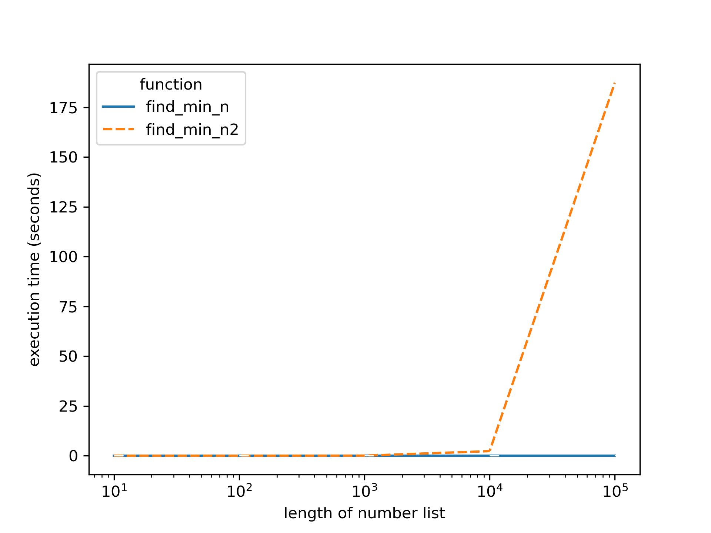

<!-- #region stylesheet -->
<head>
  <!-- style sheet -->
  <style type = text/css>
    body{
        color: white;
        background-color: rgb(60, 60, 60);
    }

<!-- I don't know why, but both `a` and `a:link` must be changed -->
<!-- to change link colors -->
    a{ color: rgb(97, 175, 239) !important; }
    a:link{ color: rgb(97, 175, 239) !important; }
    a:visited{ color: rgb(230, 180, 180) !important; }

    :is(h1, h2, h3, h4, h5, h6, p) { color: white; }

    button{
        background-color: rgb(24, 24, 24);
        border: none;
        color: white;
        display: inline-block;
        font-size: 2rem;
        padding: 0.5rem 1.2rem;
    }

    button:hover{
        background-color: rgba(74, 74, 74, 0.8);
    }

    code{
        margin-left: 0.2em;
        margin-right: 0.2em;
        outline-style: solid;
        outline-color: rgb(160, 160, 160);
        outline-width: 1px;
        outline-offset: 1px;
        background-color: rgb(50, 50, 50);
    }

    details{
        background-color: rgb(40, 40, 40);
    }

    img{
      display: block;
      float: none;
      margin: auto 0px;
      width: 60%;
    }

    pre code{
      margin-left: 0em;
      margin-right: 0em;
    }

    summary{
        background-color: rgb(60, 60, 60);
    }

    summary:hover{
        cursor: default;
    }

  </style>
</head>
<!-- #endregion -->

<!-- omit in toc -->
# Comparing O(n) and O(n^2)

<!-- omit in toc -->
## Author: Jackie Lu

<!-- omit in toc -->
## Date: 2021, Aug. 26

<section>
  <p>
    <a href="https://github.com/jql6/jql6.github.io">
      Link to the repository
    </a> | 
    <a href="https://jql6.github.io/blog">
      Return to blog
    </a>
  </p>
</section>

<!-- omit in toc -->
## Table of Contents

- [Note](#note)
- [O(n) function](#on-function)
- [O(n^2) function](#on2-function)
- [References](#references)

# Note
The Python code for the functions, unit tests, comparisons, as well as the data in csv format and image can be found in [this link to the code](https://github.com/jql6/jql6.github.io/tree/master/blog/PythonDS/3.3.%20Big-O%20Notation).

# O(n) function

```{python}
# find_min_n.py
import math


def find_min_n(numberList):
    """
    Find the minimum number in a list of numbers
    
    Keyword arguments:
    numberList -- the list of numbers
    
    Returns:
    min -- the minimum number from numberList
    """
    min = math.inf
    for number in numberList:
        if number < min:
            min = number
    return min

```

This function is `O(n)` because it loops through all of the elements in the
array once.

# O(n^2) function

```{python}
# find_min_n2.py
import math


def find_min_n2(numberList):
    """
    Find the minimum number in a list of numbers.
    
    Keyword arguments:
    numberList -- the list of numbers
    
    Returns:
    min -- the minimum number from numberList
    """
    min = math.inf
    # Loop through every number
    for number1 in numberList:
        is_min = True
        # Compare number1 with every other number in numberList
        for number2 in numberList:
            # If number1 is larger than any other number, then it's not min
            if number1 > number2:
                is_min = False
        # If the minimum number is found, return
        if is_min == True:
            min = number1
            return min
    return min

```

This function is `O(n^2)` because it loops through all of the elements in the
array twice.

Here's a plot of the execution time:
<figure>
  
  <figcaption>Here we see that execution time increases dramatically as the number of elements in the list increases.</figcaption>
</figure>

# References

Links to the resources I used can be found here:  
https://runestone.academy/runestone/books/published/pythonds/AlgorithmAnalysis/BigONotation.html

<br>
<br>
<br>
<br>
<!-- Using four breaks here so that when you scroll all the way down -->
<!-- the text content won't be stuck at the very bottom of the screen. -->
<!-- Creating table of contents with Markdown All in One by Yu Zhang. -->
