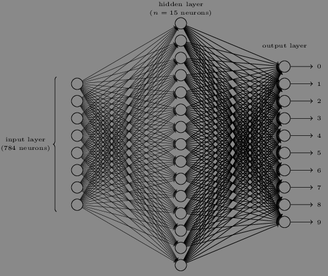
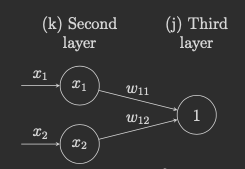

```{r setup, include=FALSE}
knitr::opts_chunk$set(echo = TRUE)
```

Book:
http://neuralnetworksanddeeplearning.com/index.html

## Chapter 1 exercises

### Sigmoid neurons simulating perceptrons, part 1  
Suppose we take all the weights and biases in a network of perceptrons, and multiply them by a positive constant, $c > 0$. Show that the behaviour of the network doesn't change.

\begin{align*}
\text{perceptron output} &= \begin{cases}
\text{output} = 0 &\text{if } \sum_j w_j x_j + b \leq 0\\
\text{output} = 1 &\text{if } \sum_j w_j x_j + b \> 0
\end{cases}\\
&\text{Multiplying weights and biases by positive constant $c$}\\
\sum_j c w_j x_j + c b &= c\ (\sum_j w_j x_j + b)\\
&= \begin{cases}
0 \text{ if } &\sum_j w_j x_j + b = 0\\
0 \text{ if } &\sum_j w_j x_j + b < 0 \text{ because positive $\times$ negative is negative}\\
1 \text{ if } &\sum_j w_j x_j + b > 0 \text{ because positive $\times$ positive
is positive}
\end{cases}
\end{align*}  
We see that multiplying a single perceptron by a positive constant $c$ doesn't change its behaviour; none of the perceptrons change in behaviour and therefore the entire network doesn't change behaviour.  

### Sigmoid neurons simulating perceptrons, part 2
Suppose we have the same setup as the last problem - a network of perceptrons. Suppose also that the overall input to the network of perceptrons has been chosen. We won't need the actual input value, we just need the input to have been fixed. Suppose the weights and biases are such that $w \cdot x + b \neq 0$ for the input $x$ to any particular perceptron in the network. Now replace all the perceptrons in the network by sigmoid neurons, and multiply the weights and biases by a positive constant $c > 0$. Show that in the limit as $c \rightarrow \infty$ the behaviour of this network of sigmoid neurons is exactly the same as the network of perceptrons. How can this fail when $w \cdot x + b = 0$ for one of the perceptrons?  

We have three cases. $w \cdot x + b$ is either negative, positive, or zero.  

\begin{align*}
\text{ If } w \cdot x + b &\text{ is negative:}\\
\lim_{c \rightarrow \infty} \frac{1}{1 + e^{-c (-w \cdot x - b)}} &=
\lim_{c \rightarrow \infty} \frac{1}{1 + e^{c (w \cdot x + b)}}\\
&= 0\\
\hline
\text{ If } w \cdot x + b &\text{ is positive:}\\
\lim_{c \rightarrow \infty} \frac{1}{1 + e^{-c (w \cdot x + b)}} &=
\lim_{c \rightarrow \infty} \frac{1}{1 + \frac{1}{e^{c (w \cdot x + b)}}}\\
&= \frac{1}{1 + 0} = 1\\
\hline
\text{ If } w \cdot x + b &\text{ is 0:}\\
\lim_{c \rightarrow \infty} \frac{1}{1 + e^{-c (0)}} &=
\lim_{c \rightarrow \infty} \frac{1}{1 + e^{0}}\\
&= \frac{1}{1 + 1} = \frac{1}{2}\\
\end{align*}
We can see that if a perceptron's $w \cdot x + b = 0$, then replacing it with a sigmoid and increase $c$ towards $\infty$ will result in a $\frac{1}{2}$ as the output instead of a 0 or 1. Perceptrons only outputs 0's or 1's, and so we see that replacing it with a sigmoid neuron has changed the behaviour of the network. However when the perceptron is not equal to 0, then as $c$ increases towards $\infty$, the behaviour of the network is the same when the perceptrons are changed into sigmoid neurons.  

### Bitwise digit representation
There is a way of determining the bitwise representation of a digit by adding an extra layer to the three-layer network above. The extra layer converts the output from the previous layer into a binary representation, as illustrated in the figure below. Find a set of weights and biases for the new output layer. Assume that the first 3 layers of neurons are such that the correct output in the third layer (i.e., the old output layer) has activation at least 0.99, and incorrect outputs have activation less than 0.01.  



\begin{array}{c | c}
\text{bitwise} & \text{number}\\
\hline
0000 & 0\\
0001 & 1\\
0010 & 2\\
0011 & 3\\
0100 & 4\\
0101 & 5\\
0110 & 6\\
0111 & 7\\
1000 & 8\\
1001 & 9
\end{array}

Each neuron in the new output layer corresponds to a bit. We can see that the leftmost bit is only 1 for the numbers 8 and 9. Let's say we adjust the weights for the neuron to be $w = (-9, -9, -9, -9, -9, -9, -9, -9, 9, 9)$ and $b = 0$. If the network detects an 8, then $x = (\texttt{rep(0.01, times = 8)}, 0.99, 0.01)$. The output is then $\frac{1}{1 + e^{w\cdot x + b}} \approx 1.00 > 0.5$. This records the bit as 1. If the network detects a 7 instead, then $x = (\texttt{rep(0.01, times = 7)}, 0.99, 0.01, 0.01)$. Output is $\frac{1} {1 + e^{w \cdot x + b}} \approx 0.00$. We can do the same for all of the other output neurons by assigning large weights such as 9 for the numbers that use that bit slot and small weights such as -9 for numbers that don't use that bit slot (ie. the second bit neuron would have large weights for 4, 5, 6, 7). We can just set the bias to 0.\\

### Proving that $\Delta v = -\eta \nabla C$ minimizes $\nabla C \cdot
\Delta v$
Prove the assertion of the last paragraph. \textit{Hint}: If you're not already
familiar with the Cauchy-Schwarz inequality, you may find it helpful to
familiarize yourself with it.  

I did not find the answer, but here is what I tried:
\begin{align*}
\Delta C &\approx \nabla C \cdot \Delta v\\
&= -\eta \nabla C \cdot \nabla C\\
&= -\epsilon \frac{|| \nabla C ||^2}{|| \nabla C ||}\\
&= -\epsilon || \nabla C ||\\
\end{align*}

I then searched here, credits to Stephen Max:
https://stephanmax.is/writing/neural-networks-and-deep-learning-exercises  
Choose another vector $d$ such that $d \neq \nabla C$ and $||d|| = \epsilon$.  
\begin{align*}
\nabla C \cdot \Delta v&= -\epsilon ||\nabla C||\\
&= -\epsilon ||\nabla C|| \times 1\\
&= -\epsilon ||\nabla C|| \frac{||d||}{\epsilon}\\
&= -||\nabla C||\ ||d||\\
&\leq \nabla C \cdot d
\end{align*}
The last two lines are due to the Cauchy-Schwarz inequality.
\begin{align*}
|\nabla C \cdot d| &\leq ||\nabla C||\ ||d||\\
-\nabla C \cdot d &\leq ||\nabla C||\ ||d||\\
\nabla C \cdot d & \geq -||\nabla C||\ ||d||
\end{align*}
If we then sub $-||\nabla C||\ ||d||$ with $\nabla C \cdot \Delta v$, we get
$\nabla C \cdot d \geq -\nabla C \cdot \Delta v$, which means that choosing
any other vector other than $v$ will result in an equal decrease or smaller
decrease.  

### Geometric interpretation of one-dimensional gradient descent
I explained gradient descent when $C$ is a function of two variables, and when it's a function of more than two variables. What happens when $C$ is a function of just one variable? Can you provide a geometric interpretation of what gradient descent is doing in the one-dimensional case?  

In the one dimensional case, $\nabla C$ is just the derivative; there are no
partial derivatives because there is only one variable. $\eta$ is simply a
scalar that doesn't affect direction. We know that the gradient is always
pointed in the direction of the steepest ascent. This means that $\Delta v = 
\eta \nabla C$ is pointed in the direction of the steepest descent, which is
just the negative, absolute value of the derivative. So we are taking steps
in the negative absolute derivative direction, scaled by $\eta$.  

Given $y = x^2$, this looks like a raindrop gliding down the surface of the
curve; the object is now descending in a 2d area instead of a 3d area.\\

### Extreme mini-batch gradient descent
An extreme version of gradient descent is to use a mini-batch size of just 1. That is, given a training input, $x$, we update our weights and biases according to the rules $w_k \rightarrow w_k' = w_k - \eta \frac{\delta C_x}{\delta w_k}$ and $b_l \rightarrow b_l' = b_l - \eta \frac{\delta C_x}{\delta b_l}$. Then we choose another training input, and update the weights and biases again. And so on, repeatedly. This procedure is known as \textit{online}, \textit{on-line}, or \textit{incremental} learning. In online learning, a neural network learns from just one training input at a time (just as human beings do). Name one advantage and one disadvantage of online learning, compared to stochastic gradient descent with a mini-batch size of, say, 20.  

We note that the textbook says until we've exhausted the training inputs, indicating that there is a finite population and that we are sampling without replacement (If there was an infinite population or if we are sampling with replacement, we cannot exhaust the training inputs). This means that the variance of $\widehat{\nabla C}$ includes the finite population correction of $1 - \frac{n}{N}$ where n is the number of sampled training inputs and $N$ is the number of total training inputs. As we increase the amount sampled, we decrease the variance until $n = N$, where the variance becomes 0 (If you  sample the entire population, there is no variance, you have the population value). We can see that the variance is large when $n$ is small. This means that although we can obtain an estimate of $\nabla C$ very quickly with mini-batch size of 1, we also have the largest possible variance.  

We can see that there is a tradeoff between the speed of estimating $\nabla C$
and the variance of our estimates.  

### Verifying Equation 22
Write out Equation 22 in component form, and verify that it gives the same
result as the rule 4 for computing the output of a sigmoid neuron.  

Start with second layer two neurons, third layer one neurons to clarify the subscripts. $w_{j k}$ is the weight between $k$th neuron in the second layer and $j$th neuron in the third layer.



The activation is $\sum_{k = 1}^2 w_{1k} x_k + b$ or $w_{11} x_1 + w_{12} x_2 + b$. Now let's generalize to a second layer with $k$ neurons and focus on a single neuron in the third layer, then apply the $\sigma$ function.
\begin{align*}
a' &= \sigma(wa + b)\\
&= \sigma(\sum_k w_{1k} x_k - b)\\
&= \sigma(\sum_k w_k x_k - b) &\text{Drop 1 because we only care about one neuron in third layer}
&= \frac{1}{1 - e^{- \sum_k w_k x_k - b}}
\end{align*}
This is the same as $\frac{1}{1 + \text{exp}(-\sum_j w_j x_j - b)}$, except we use a different letter for the subscripts.\\

\textbf{Bonus}
The reason why $j$ is used for the third layer and $k$ is used for the second layer for $w_{j k}$ is because if we have $j$ for the second layer and $k$ for the third layer, then
$$
\left[\begin{array}{c c}
w_{1 1} & w_{1 2}\\
w_{2 1} & w_{2 2}
\end{array}\right] \left[\begin{array}{c} x_1\\ x_2 \end{array}\right] =
\left[\begin{array}{c}
w_{1 1} x_1 + w_{1 2} x_2\\
w_{2 1} x_1 + w_{2 2} x_2
\end{array}\right]$$
doesn't make sense. The equation above says that the activation of the first neuron in the third layer contains weights between first neuron in the second layer and all neurons in the third layer. The activation should instead contain weights between the first neuron in the **third** layer and all neurons in the **second** layer.  

### Stochastic gradient descent with no hidden layer
Using the code
\begin{align*}
&>>>\texttt{import mnist_loader}\\
&>>>\texttt{training_data, validation_data, test_data = \\}\\
&\texttt{... mnist_loader.load_data_wrapper()}\\
&>>>\texttt{import network}\\
&>>>\texttt{net = network.Network([784, 0, 10])}\\
&>>>\texttt{net.SGD(training_data, 30, 10, 3.0, test_data = test_data)}
\end{align*}
Our best result is 1135 / 10000, which is not much better than just randomly guessing (1000 / 10000). It appears that having at least one hidden layer is really important. Also, the epochs don't seem to get any better.  

## Chapter 2 exercises and problems

### Alternate presentation of the equations of backpropagation
I've stated the equations of backpropagation (notably (BP1) and (BP2)) using the Hadamard product. This presentation may be disconcerting if you're unused to the Hadamard product. There's an alternative approach based on conventional matrix multiplacation which some readers may find enlightening.  

(1) Show that (BP1) may be rewritten as
$$\delta^L = \sum \text{'}(z^L) \nabla_a C$$
where $\sum \text{'}(z^L)$ is a square matrix whose diagonal entries are the values $\sigma \text{'}(z_j^L)$, and whose off-diagonal entries are zero. Note that this matrix acts on $\nabla_a C$ by conventional matrix multiplication.\\

Let's work with $j = 1, 2$.
\begin{align*}
\text{(BP1a) } \delta^L &= \nabla_a C \odot \sigma'(z^L)\\
&= \left[\begin{array}{c} \frac{\delta C}{\delta a_1^L}\\ \frac{\delta C}{\delta a_2^L} \end{array}\right] \odot \left[\begin{array}{c} \sigma' (z_1^L)\\ \sigma' (z_2^L) \end{array}\right]\\
&= \left[\begin{array}{c} \frac{\delta C}{\delta a_1^L} \sigma' (z_1^L)\\ \frac{\delta C}{\delta a_2^L} \sigma' (z_2^L) \end{array}\right]\\
&\\
\text{(33)} \delta^L &= \sum \text{'} (z^L) \nabla_a C\\
&= \left[\begin{array}{c c} \sigma'(z_1^L) & 0\\ 0 & \sigma'(z_2^L)\end{array}\right] \left[\begin{array}{c}\frac{\delta C}{\delta a_1^L}\\ \frac{\delta C}{\delta a_2^L}\end{array}\right]\\
\text{Dimensions are } &2 \times 2\ \ \times\ \ 2 \times 1 = 2 \times 1\\
&= \left[\begin{array}{c} \sigma'(z_1^L) \frac{\delta C}{\delta a_1^L} + 0\\ 0 + \sigma' (z_2^L) \frac{\delta C}{\delta a_2^L}\end{array}\right]\\
&= \left[\begin{array}{c} \frac{\delta C}{\delta a_1^L} \sigma'(z_1^L)\\ \frac{\delta C}{\delta a_2^L} \sigma' (z_2^L)\end{array}\right] = \text{(BP1a)}
\end{align*}

(2) Show that (BP2) may be rewritten as
$$\delta^l = \sum \text{'}(z^l) (w^{l + 1})^T \delta^{l + 1}$$

Remember that $l$ is the $l^{\text{th}}$ layer of the network whilst $L$ is the number of layers in the network. Let's work with $l = 1, 2$; $L = 3$.

\begin{align*}
\text{(BP2) } \delta^l &= ((w^{l + 1})^T \delta^{l + 1}) \odot \sigma'(z^l)\\
&= \left[\begin{array}{c} \frac{\delta C}{\delta a_1^L} \sigma' (z_1^L)\\ \frac{\delta C}{\delta a_2^L} \sigma' (z_2^L) \end{array}\right]\\
&\\
\delta^l &= \sum \text{'} (z^l) (w^{l + 1})^T \delta^{l + 1}\\
&= \left[\begin{array}{c c} z^l_1 & 0\\ 0 & z^l_2\end{array}\right] \left[\begin{array}{c}(w^{l + 1}_1)^T \delta^{l + 1}_1\\ (w^{l + 1}_2)^T \delta^{l + 1}_2\end{array}\right]\\
&= \left[\begin{array}{c} \frac{\delta C}{\delta a_1^L} \sigma' (z_1^L)\\ \frac{\delta C}{\delta a_2^L} \sigma' (z_2^L) \end{array}\right]\\
&= \text{(BP2)}
\end{align*}

(3) By combining observations (1) and (2), show that
$$\delta^l = \sum \text{'}(z^l) (w^{l + 1})^T ... \sum \text{'}(z^{L - 1}) (w^L)^T \sum \text{'} (z^L) \nabla_a C$$
Let's continue using $l = 1, 2$; $L = 3$.\\
\begin{align*}
\delta^1 &= \sum \text{'} (z^1) (w^{1 + 1})^T \delta^{1 + 1}\\
&= \sum \text{'} (z^1) (w^2)^T \delta^2\\
\delta^2 &= \sum \text{'} (z^2) (w^3)^T \delta^3\\
\delta^1 &= \sum \text{'} (z^1) (w^2)^T \sum \text{'} (z^2) (w^3)^T \delta^3\\
\delta^3 = \delta^L &= \sum \text{'}(z^3) \nabla_a C\\
\delta^1 &= \sum \text{'} (z^1) (w^2)^T \sum \text{'} (z^2) (w^3)^T \sum \text{'}(z^3) \nabla_a C\\
\end{align*}

We see that the the equation above for $\delta^l$ holds up.

\textbf{Proof of the third and fourth backpropagation equations}
Prove equations (BP3) and (BP4).\\
$$\text{(BP3): } \frac{\delta C}{\delta b_j^l} = \delta_j^l;\ \text{(BP4): } \frac{\delta C}{\delta w_{j k}^l} = a_k^{l - 1} \delta_j^l$$

(BP3):
\begin{align*}
\delta_j^l &= \frac{\delta C}{\delta z_j^l}\\
&= \sum_k \frac{\delta C}{\delta b_k^l} \frac{\delta b_k^l}{\delta z_j^l}\\
\hline
&= \frac{\delta C}{\delta b_j^l} \frac{\delta b_j^l}{\delta z_j^l}\\
\hline
&= \frac{\delta C}{\delta b_j^l}
\end{align*}

In the bit below the first horizontal line, we note that $\frac{\delta b_k^l}{\delta z_j^l} = 0$ if $k \neq j$. $z_j^l$ only depends on the biases $b_k^l$ in its own layer; the weighted input of a neuron only depends on the biases it receives and not on the biases of other neurons. We can then remove the summation sign because the only non-zero term is when $k = j$.  

For the portion below the second horizontal line, we note that $\frac{\delta z_j^l}{\delta b_j^l} = 1$ (differentiating $z_j^l = \sum_k w_{j k}^l a_k^{l - 1} + b_j^l$ with respect to the bias $b_j^l$, the rate of change is just 1). Therefore $\frac{\delta b_j^l}{\delta z_j^l} = 1$ and we get the portion below the second line.  

(BP4):
\begin{align*}
\delta_j^l &= \frac{\delta C}{\delta z_j^l}\\
&= \sum_k \frac{\delta C}{\delta w_{j k}^l} \frac{\delta w_{j k}^l}{\delta z_j^l}\\
\hline
&= \sum_k \frac{\delta C}{\delta w_{j k}^l} \frac{1}{a_k^{l - 1}}\\
\delta_j^l \sum_k a_k^{l - 1} &= \sum_k \frac{\delta C}{\delta w_{j k}^l}
\end{align*}

The portion under the first line results from realizing that $\frac{\delta z_j^l}{\delta w_{j k}^l} = \sum_k a_k^{l - 1}$ (differentiate $z_j^l = \sum_k w_{j k}^l a_k^{l - 1} + b_j^l$ with respect to $w_{j k}^l$). Therefore $\frac{\delta w_{j k}^l}{\delta z_j^l} = \frac{1}{\sum_k a_k^{l - 1}}$.

I'm not sure how to get rid of the summation sign. I think it has to stay because the activation of a neuron depends on the sum of weights that enter it. I am assuming that the difference in notation is the difference between component form and the non-component form; I am choosing not to further investigate this.  

### Backpropagation with a single modified neuron
Suppose we modify a single neuron in a feedforward network so that the output from the neuron is given by $f(\sum_j w_j x_j + b)$, where $f$ is some function other than the sigmoid. How should we modify the backpropagation algorithm in this case?  

Let's try an example with three layers; input, output, and one hidden. We will change the activation of the second layer, which is the hidden layer. The first step of the algorithm doesn't change; we are just setting an activation.  
Feedforward:
\begin{align*}
a^2 &= f(z^2)\\
z^3 &= w^3 a^2 + b^3 = w^3 f(z^l) + b^3\\
a^3 &= \sigma(z^3)\\
\end{align*}
Here we make the change of using $f$ instead of $\sigma$ for the weighted input $z^2$.  
The output error value changes, but we don't need to modify the algorithm.  
Backpropagate the error:
\begin{align*}
\delta^2 &= ((w^3)^T \delta^3) \odot f'(z^2)
\end{align*}
Here we have to use the derivative of the $f$ function for the weighted input $z^2$ because we used the $f$ function for the same weighted input in our feedforward step. Note that we know these are the same functions because the feedforward step has $L - 1$ weighted inputs $z^l$ and the output error plus the backpropagate the error steps also have $L - 1$ steps that include the weighted inputs $z^l$.  
Output value is different, but we don't need to adjust the algorithm here because none of them directly use functions of weighted inputs.  

Overall we notice that when changing one of the functions of a particular layer's weighted input, we have to adjust the error steps as well. If the layer is not the last one, we have to change the derivative of the weighted input to be the derivative of the proper function. If the layer is the last, then we change the derivative of the function in the output error step.  

### Backpropagation with linear neurons
Suppose we replace the usual non-linear $\sigma$ function with $\sigma(z) = z$ throughout the network. Rewrite the backpropagation algorithm for this case.  

Let's examine the steps when this change occurs. The input step does not change because it does not deal with weighted inputs. The feedforward step changes; $a^l = z^l$. If we continue to the next layer, then $a^{l + 1} = w^{l + 1} z^l + b^{l + 1}$. Each additional layer just adds weights and biases to the previous layer. In the output error, we also have a change. The derivative of $z^L$ with respect to the activation $a$ is just the weight $w$. We get $\delta^L = \nabla_a C \odot \sigma'(z^L) = \nabla_a C \odot w^L$. This is the same with the backpropagate the error step; we change the derivative in the same way. The output step does not change because there aren't any weighted inputs directly in the formulas anymore.  

\section*{Chapter 3 exercises}

### Derivative of the sigmoid function 
Verify that $\sigma'(z) = \sigma(z) (1 - \sigma(z))$. $\sigma(z) = \frac{1}{1 + e^{-z}}$
