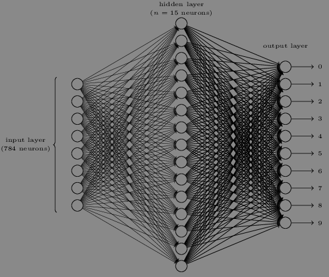

```{r setup, include=FALSE}
knitr::opts_chunk$set(echo = TRUE)
```
[Return to homepage](https://jql6.github.io/)

Exercises from this [book by Michael Nielsen](http://neuralnetworksanddeeplearning.com/index.html).

## Chapter 1 exercises

### Sigmoid neurons simulating perceptrons, part 1  
Suppose we take all the weights and biases in a network of perceptrons, and multiply them by a positive constant, $c > 0$. Show that the behaviour of the network doesn't change.

\begin{align*}
\text{perceptron output} &= \begin{cases}
\text{output} = 0 &\text{if } \sum_j w_j x_j + b \leq 0\\
\text{output} = 1 &\text{if } \sum_j w_j x_j + b \> 0
\end{cases}\\
&\text{Multiplying weights and biases by positive constant $c$}\\
\sum_j c w_j x_j + c b &= c\ (\sum_j w_j x_j + b)\\
&= \begin{cases}
0 \text{ if } &\sum_j w_j x_j + b = 0\\
0 \text{ if } &\sum_j w_j x_j + b < 0 \text{ because positive $\times$ negative is negative}\\
1 \text{ if } &\sum_j w_j x_j + b > 0 \text{ because positive $\times$ positive
is positive}
\end{cases}
\end{align*}  
We see that multiplying a single perceptron by a positive constant $c$ doesn't change its behaviour; none of the perceptrons change in behaviour and therefore the entire network doesn't change behaviour.  

### Sigmoid neurons simulating perceptrons, part 2
Suppose we have the same setup as the last problem - a network of perceptrons. Suppose also that the overall input to the network of perceptrons has been chosen. We won't need the actual input value, we just need the input to have been fixed. Suppose the weights and biases are such that $w \cdot x + b \neq 0$ for the input $x$ to any particular perceptron in the network. Now replace all the perceptrons in the network by sigmoid neurons, and multiply the weights and biases by a positive constant $c > 0$. Show that in the limit as $c \rightarrow \infty$ the behaviour of this network of sigmoid neurons is exactly the same as the network of perceptrons. How can this fail when $w \cdot x + b = 0$ for one of the perceptrons?  

We have three cases. $w \cdot x + b$ is either negative, positive, or zero.  

\begin{align*}
\text{ If } w \cdot x + b &\text{ is negative:}\\
\lim_{c \rightarrow \infty} \frac{1}{1 + e^{-c (-w \cdot x - b)}} &=
\lim_{c \rightarrow \infty} \frac{1}{1 + e^{c (w \cdot x + b)}}\\
&= 0\\
\hline
\text{ If } w \cdot x + b &\text{ is positive:}\\
\lim_{c \rightarrow \infty} \frac{1}{1 + e^{-c (w \cdot x + b)}} &=
\lim_{c \rightarrow \infty} \frac{1}{1 + \frac{1}{e^{c (w \cdot x + b)}}}\\
&= \frac{1}{1 + 0} = 1\\
\hline
\text{ If } w \cdot x + b &\text{ is 0:}\\
\lim_{c \rightarrow \infty} \frac{1}{1 + e^{-c (0)}} &=
\lim_{c \rightarrow \infty} \frac{1}{1 + e^{0}}\\
&= \frac{1}{1 + 1} = \frac{1}{2}\\
\end{align*}
We can see that if a perceptron's $w \cdot x + b = 0$, then replacing it with a sigmoid and increase $c$ towards $\infty$ will result in a $\frac{1}{2}$ as the output instead of a 0 or 1. Perceptrons only outputs 0's or 1's, and so we see that replacing it with a sigmoid neuron has changed the behaviour of the network. However when the perceptron is not equal to 0, then as $c$ increases towards $\infty$, the behaviour of the network is the same when the perceptrons are changed into sigmoid neurons.  

### Bitwise digit representation
There is a way of determining the bitwise representation of a digit by adding an extra layer to the three-layer network above. The extra layer converts the output from the previous layer into a binary representation, as illustrated in the figure below. Find a set of weights and biases for the new output layer. Assume that the first 3 layers of neurons are such that the correct output in the third layer (i.e., the old output layer) has activation at least 0.99, and incorrect outputs have activation less than 0.01.  



\begin{array}{c | c}
\text{bitwise} & \text{number}\\
\hline
0000 & 0\\
0001 & 1\\
0010 & 2\\
0011 & 3\\
0100 & 4\\
0101 & 5\\
0110 & 6\\
0111 & 7\\
1000 & 8\\
1001 & 9
\end{array}

Each neuron in the new output layer corresponds to a bit. We can see that the leftmost bit is only 1 for the numbers 8 and 9. Let's say we adjust the weights for the neuron to be $w = (-9, -9, -9, -9, -9, -9, -9, -9, 9, 9)$ and $b = 0$. If the network detects an 8, then $x = (\texttt{rep(0.01, times = 8)}, 0.99, 0.01)$. The output is then $\frac{1}{1 + e^{w\cdot x + b}} \approx 1.00 > 0.5$. This records the bit as 1. If the network detects a 7 instead, then $x = (\texttt{rep(0.01, times = 7)}, 0.99, 0.01, 0.01)$. Output is $\frac{1} {1 + e^{w \cdot x + b}} \approx 0.00$. We can do the same for all of the other output neurons by assigning large weights such as 9 for the numbers that use that bit slot and small weights such as -9 for numbers that don't use that bit slot (ie. the second bit neuron would have large weights for 4, 5, 6, 7). We can just set the bias to 0.\\

### Proving that $\Delta v = -\eta \nabla C$ minimizes $\nabla C \cdot
\Delta v$
Prove the assertion of the last paragraph. \textit{Hint}: If you're not already
familiar with the Cauchy-Schwarz inequality, you may find it helpful to
familiarize yourself with it.  

I did not find the answer, but here is what I tried:
\begin{align*}
\Delta C &\approx \nabla C \cdot \Delta v\\
&= -\eta \nabla C \cdot \nabla C\\
&= -\epsilon \frac{|| \nabla C ||^2}{|| \nabla C ||}\\
&= -\epsilon || \nabla C ||\\
\end{align*}

I then searched here, credits to Stephen Max:
https://stephanmax.is/writing/neural-networks-and-deep-learning-exercises  
Choose another vector $d$ such that $d \neq \nabla C$ and $||d|| = \epsilon$.  
\begin{align*}
\nabla C \cdot \Delta v&= -\epsilon ||\nabla C||\\
&= -\epsilon ||\nabla C|| \times 1\\
&= -\epsilon ||\nabla C|| \frac{||d||}{\epsilon}\\
&= -||\nabla C||\ ||d||\\
&\leq \nabla C \cdot d
\end{align*}
The last two lines are due to the Cauchy-Schwarz inequality.
\begin{align*}
|\nabla C \cdot d| &\leq ||\nabla C||\ ||d||\\
-\nabla C \cdot d &\leq ||\nabla C||\ ||d||\\
\nabla C \cdot d & \geq -||\nabla C||\ ||d||
\end{align*}
If we then sub $-||\nabla C||\ ||d||$ with $\nabla C \cdot \Delta v$, we get
$\nabla C \cdot d \geq -\nabla C \cdot \Delta v$, which means that choosing
any other vector other than $v$ will result in an equal decrease or smaller
decrease.  

### Geometric interpretation of one-dimensional gradient descent
I explained gradient descent when $C$ is a function of two variables, and when it's a function of more than two variables. What happens when $C$ is a function of just one variable? Can you provide a geometric interpretation of what gradient descent is doing in the one-dimensional case?  

In the one dimensional case, $\nabla C$ is just the derivative; there are no
partial derivatives because there is only one variable. $\eta$ is simply a
scalar that doesn't affect direction. We know that the gradient is always
pointed in the direction of the steepest ascent. This means that $\Delta v = 
\eta \nabla C$ is pointed in the direction of the steepest descent, which is
just the negative, absolute value of the derivative. So we are taking steps
in the negative absolute derivative direction, scaled by $\eta$.  

Given $y = x^2$, this looks like a raindrop gliding down the surface of the
curve; the object is now descending in a 2d area instead of a 3d area.\\

### Extreme mini-batch gradient descent
An extreme version of gradient descent is to use a mini-batch size of just 1. That is, given a training input, $x$, we update our weights and biases according to the rules $w_k \rightarrow w_k' = w_k - \eta \frac{\delta C_x}{\delta w_k}$ and $b_l \rightarrow b_l' = b_l - \eta \frac{\delta C_x}{\delta b_l}$. Then we choose another training input, and update the weights and biases again. And so on, repeatedly. This procedure is known as \textit{online}, \textit{on-line}, or \textit{incremental} learning. In online learning, a neural network learns from just one training input at a time (just as human beings do). Name one advantage and one disadvantage of online learning, compared to stochastic gradient descent with a mini-batch size of, say, 20.  

We note that the textbook says until we've exhausted the training inputs, indicating that there is a finite population and that we are sampling without replacement (If there was an infinite population or if we are sampling with replacement, we cannot exhaust the training inputs). This means that the variance of $\widehat{\nabla C}$ includes the finite population correction of $1 - \frac{n}{N}$ where n is the number of sampled training inputs and $N$ is the number of total training inputs. As we increase the amount sampled, we decrease the variance until $n = N$, where the variance becomes 0 (If you  sample the entire population, there is no variance, you have the population value). We can see that the variance is large when $n$ is small. This means that although we can obtain an estimate of $\nabla C$ very quickly with mini-batch size of 1, we also have the largest possible variance.  

We can see that there is a tradeoff between the speed of estimating $\nabla C$
and the variance of our estimates.  

### Verifying Equation 22
Write out Equation 22 in component form, and verify that it gives the same
result as the rule 4 for computing the output of a sigmoid neuron.  

Start with second layer two neurons, third layer one neurons to clarify the subscripts. $w_{j k}$ is the weight between $k$th neuron in the second layer and $j$th neuron in the third layer.


The activation is $\sum_{k = 1}^2 w_{1k} x_k + b$ or $w_{11} x_1 + w_{12} x_2 + b$. Now let's generalize to a second layer with $k$ neurons and focus on a single neuron in the third layer, then apply the $\sigma$ function.
\begin{align*}
a' &= \sigma(wa + b)\\
&= \sigma(\sum_k w_{1k} x_k - b)\\
&= \sigma(\sum_k w_k x_k - b) &\text{Drop 1 because we only care about one neuron in third layer}
&= \frac{1}{1 - e^{- \sum_k w_k x_k - b}}
\end{align*}
This is the same as $\frac{1}{1 + \text{exp}(-\sum_j w_j x_j - b)}$, except we use a different letter for the subscripts.\\

\textbf{Bonus}
The reason why $j$ is used for the third layer and $k$ is used for the second layer for $w_{j k}$ is because if we have $j$ for the second layer and $k$ for the third layer, then
$$
\left[\begin{array}{c c}
w_{1 1} & w_{1 2}\\
w_{2 1} & w_{2 2}
\end{array}\right] \left[\begin{array}{c} x_1\\ x_2 \end{array}\right] =
\left[\begin{array}{c}
w_{1 1} x_1 + w_{1 2} x_2\\
w_{2 1} x_1 + w_{2 2} x_2
\end{array}\right]$$
doesn't make sense. The equation above says that the activation of the first neuron in the third layer contains weights between first neuron in the second layer and all neurons in the third layer. The activation should instead contain weights between the first neuron in the **third** layer and all neurons in the **second** layer.  

### Stochastic gradient descent with no hidden layer
Using the code
\begin{align*}
&>>>\texttt{import mnist_loader}\\
&>>>\texttt{training_data, validation_data, test_data = \\}\\
&\texttt{... mnist_loader.load_data_wrapper()}\\
&>>>\texttt{import network}\\
&>>>\texttt{net = network.Network([784, 0, 10])}\\
&>>>\texttt{net.SGD(training_data, 30, 10, 3.0, test_data = test_data)}
\end{align*}
Our best result is 1135 / 10000, which is not much better than just randomly guessing (1000 / 10000). It appears that having at least one hidden layer is really important. Also, the epochs don't seem to get any better.  

## Chapter 2 exercises and problems

### Alternate presentation of the equations of backpropagation
I've stated the equations of backpropagation (notably (BP1) and (BP2)) using the Hadamard product. This presentation may be disconcerting if you're unused to the Hadamard product. There's an alternative approach based on conventional matrix multiplacation which some readers may find enlightening.  

(1) Show that (BP1) may be rewritten as
$$\delta^L = \sum \text{'}(z^L) \nabla_a C$$
where $\sum \text{'}(z^L)$ is a square matrix whose diagonal entries are the values $\sigma \text{'}(z_j^L)$, and whose off-diagonal entries are zero. Note that this matrix acts on $\nabla_a C$ by conventional matrix multiplication.\\

Let's work with $j = 1, 2$.
\begin{align*}
\text{(BP1a) } \delta^L &= \nabla_a C \odot \sigma'(z^L)\\
&= \left[\begin{array}{c} \frac{\delta C}{\delta a_1^L}\\ \frac{\delta C}{\delta a_2^L} \end{array}\right] \odot \left[\begin{array}{c} \sigma' (z_1^L)\\ \sigma' (z_2^L) \end{array}\right]\\
&= \left[\begin{array}{c} \frac{\delta C}{\delta a_1^L} \sigma' (z_1^L)\\ \frac{\delta C}{\delta a_2^L} \sigma' (z_2^L) \end{array}\right]\\
&\\
\text{(33)} \delta^L &= \sum \text{'} (z^L) \nabla_a C\\
&= \left[\begin{array}{c c} \sigma'(z_1^L) & 0\\ 0 & \sigma'(z_2^L)\end{array}\right] \left[\begin{array}{c}\frac{\delta C}{\delta a_1^L}\\ \frac{\delta C}{\delta a_2^L}\end{array}\right]\\
\text{Dimensions are } &2 \times 2\ \ \times\ \ 2 \times 1 = 2 \times 1\\
&= \left[\begin{array}{c} \sigma'(z_1^L) \frac{\delta C}{\delta a_1^L} + 0\\ 0 + \sigma' (z_2^L) \frac{\delta C}{\delta a_2^L}\end{array}\right]\\
&= \left[\begin{array}{c} \frac{\delta C}{\delta a_1^L} \sigma'(z_1^L)\\ \frac{\delta C}{\delta a_2^L} \sigma' (z_2^L)\end{array}\right] = \text{(BP1a)}
\end{align*}

(2) Show that (BP2) may be rewritten as
$$\delta^l = \sum \text{'}(z^l) (w^{l + 1})^T \delta^{l + 1}$$

Remember that $l$ is the $l^{\text{th}}$ layer of the network whilst $L$ is the number of layers in the network. Let's work with $l = 1, 2$; $L = 3$.

\begin{align*}
\text{(BP2) } \delta^l &= ((w^{l + 1})^T \delta^{l + 1}) \odot \sigma'(z^l)\\
&= \left[\begin{array}{c} \frac{\delta C}{\delta a_1^L} \sigma' (z_1^L)\\ \frac{\delta C}{\delta a_2^L} \sigma' (z_2^L) \end{array}\right]\\
&\\
\delta^l &= \sum \text{'} (z^l) (w^{l + 1})^T \delta^{l + 1}\\
&= \left[\begin{array}{c c} z^l_1 & 0\\ 0 & z^l_2\end{array}\right] \left[\begin{array}{c}(w^{l + 1}_1)^T \delta^{l + 1}_1\\ (w^{l + 1}_2)^T \delta^{l + 1}_2\end{array}\right]\\
&= \left[\begin{array}{c} \frac{\delta C}{\delta a_1^L} \sigma' (z_1^L)\\ \frac{\delta C}{\delta a_2^L} \sigma' (z_2^L) \end{array}\right]\\
&= \text{(BP2)}
\end{align*}

(3) By combining observations (1) and (2), show that
$$\delta^l = \sum \text{'}(z^l) (w^{l + 1})^T ... \sum \text{'}(z^{L - 1}) (w^L)^T \sum \text{'} (z^L) \nabla_a C$$
Let's continue using $l = 1, 2$; $L = 3$.\\
\begin{align*}
\delta^1 &= \sum \text{'} (z^1) (w^{1 + 1})^T \delta^{1 + 1}\\
&= \sum \text{'} (z^1) (w^2)^T \delta^2\\
\delta^2 &= \sum \text{'} (z^2) (w^3)^T \delta^3\\
\delta^1 &= \sum \text{'} (z^1) (w^2)^T \sum \text{'} (z^2) (w^3)^T \delta^3\\
\delta^3 = \delta^L &= \sum \text{'}(z^3) \nabla_a C\\
\delta^1 &= \sum \text{'} (z^1) (w^2)^T \sum \text{'} (z^2) (w^3)^T \sum \text{'}(z^3) \nabla_a C\\
\end{align*}

We see that the the equation above for $\delta^l$ holds up.

\textbf{Proof of the third and fourth backpropagation equations}
Prove equations (BP3) and (BP4).\\
$$\text{(BP3): } \frac{\delta C}{\delta b_j^l} = \delta_j^l;\ \text{(BP4): } \frac{\delta C}{\delta w_{j k}^l} = a_k^{l - 1} \delta_j^l$$

(BP3):
\begin{align*}
\delta_j^l &= \frac{\delta C}{\delta z_j^l}\\
&= \sum_k \frac{\delta C}{\delta b_k^l} \frac{\delta b_k^l}{\delta z_j^l}\\
\hline
&= \frac{\delta C}{\delta b_j^l} \frac{\delta b_j^l}{\delta z_j^l}\\
\hline
&= \frac{\delta C}{\delta b_j^l}
\end{align*}

In the bit below the first horizontal line, we note that $\frac{\delta b_k^l}{\delta z_j^l} = 0$ if $k \neq j$. $z_j^l$ only depends on the biases $b_k^l$ in its own layer; the weighted input of a neuron only depends on the biases it receives and not on the biases of other neurons. We can then remove the summation sign because the only non-zero term is when $k = j$.  

For the portion below the second horizontal line, we note that $\frac{\delta z_j^l}{\delta b_j^l} = 1$ (differentiating $z_j^l = \sum_k w_{j k}^l a_k^{l - 1} + b_j^l$ with respect to the bias $b_j^l$, the rate of change is just 1). Therefore $\frac{\delta b_j^l}{\delta z_j^l} = 1$ and we get the portion below the second line.  

(BP4):
\begin{align*}
\delta_j^l &= \frac{\delta C}{\delta z_j^l}\\
&= \sum_k \frac{\delta C}{\delta w_{j k}^l} \frac{\delta w_{j k}^l}{\delta z_j^l}\\
\hline
&= \sum_k \frac{\delta C}{\delta w_{j k}^l} \frac{1}{a_k^{l - 1}}\\
\delta_j^l \sum_k a_k^{l - 1} &= \sum_k \frac{\delta C}{\delta w_{j k}^l}
\end{align*}

The portion under the first line results from realizing that $\frac{\delta z_j^l}{\delta w_{j k}^l} = \sum_k a_k^{l - 1}$ (differentiate $z_j^l = \sum_k w_{j k}^l a_k^{l - 1} + b_j^l$ with respect to $w_{j k}^l$). Therefore $\frac{\delta w_{j k}^l}{\delta z_j^l} = \frac{1}{\sum_k a_k^{l - 1}}$.

I'm not sure how to get rid of the summation sign. I think it has to stay because the activation of a neuron depends on the sum of weights that enter it. I am assuming that the difference in notation is the difference between component form and the non-component form; I am choosing not to further investigate this.  

### Backpropagation with a single modified neuron
Suppose we modify a single neuron in a feedforward network so that the output from the neuron is given by $f(\sum_j w_j x_j + b)$, where $f$ is some function other than the sigmoid. How should we modify the backpropagation algorithm in this case?  

Let's try an example with three layers; input, output, and one hidden. We will change the activation of the second layer, which is the hidden layer. The first step of the algorithm doesn't change; we are just setting an activation.  
Feedforward:
\begin{align*}
a^2 &= f(z^2)\\
z^3 &= w^3 a^2 + b^3 = w^3 f(z^l) + b^3\\
a^3 &= \sigma(z^3)\\
\end{align*}
Here we make the change of using $f$ instead of $\sigma$ for the weighted input $z^2$.  
The output error value changes, but we don't need to modify the algorithm.  
Backpropagate the error:
\begin{align*}
\delta^2 &= ((w^3)^T \delta^3) \odot f'(z^2)
\end{align*}
Here we have to use the derivative of the $f$ function for the weighted input $z^2$ because we used the $f$ function for the same weighted input in our feedforward step. Note that we know these are the same functions because the feedforward step has $L - 1$ weighted inputs $z^l$ and the output error plus the backpropagate the error steps also have $L - 1$ steps that include the weighted inputs $z^l$.  
Output value is different, but we don't need to adjust the algorithm here because none of them directly use functions of weighted inputs.  

Overall we notice that when changing one of the functions of a particular layer's weighted input, we have to adjust the error steps as well. If the layer is not the last one, we have to change the derivative of the weighted input to be the derivative of the proper function. If the layer is the last, then we change the derivative of the function in the output error step.  

### Backpropagation with linear neurons
Suppose we replace the usual non-linear $\sigma$ function with $\sigma(z) = z$ throughout the network. Rewrite the backpropagation algorithm for this case.  

Let's examine the steps when this change occurs. The input step does not change because it does not deal with weighted inputs. The feedforward step changes; $a^l = z^l$. If we continue to the next layer, then $a^{l + 1} = w^{l + 1} z^l + b^{l + 1}$. Each additional layer just adds weights and biases to the previous layer. In the output error, we also have a change. The derivative of $z^L$ with respect to the activation $a$ is just the weight $w$. We get $\delta^L = \nabla_a C \odot \sigma'(z^L) = \nabla_a C \odot w^L$. This is the same with the backpropagate the error step; we change the derivative in the same way. The output step does not change because there aren't any weighted inputs directly in the formulas anymore.  

# Chapter 3 exercises

### Derivative of the sigmoid function 
Verify that $\sigma'(z) = \sigma(z) (1 - \sigma(z))$. $\sigma(z) = \frac{1}{1 + e^{-z}}$

\begin{align*}
\frac{d \sigma}{dz} &= \frac{d}{dz} \frac{1}{1 + e^{-z}}\\
&= \frac{d}{dz} (1 + e^{-z})^{-1}\\
&= -(1 + e^{-z})^{-2} \times -e^{-z}\\
&= \frac{e^{-z}}{(1 + e^{-z})^2}\\
&= \frac{1}{1 + e^{-z}} \frac{e^{-z}}{1 + e^{-z}}\\
&= \frac{1}{1 + e^{-z}} \frac{e^{-z} + 1 - 1}{1 + e^{-z}}\\
&= \frac{1}{1 + e^{-z}} \frac{(1 + e^{-z}) - 1}{(1 + e^{-z})}\\
&= \frac{1}{1 + e^{-z}} (1 - \frac{1}{1 + e^{-z}})\\
&= \sigma(z) (1 - \sigma(z))
\end{align*}

### Remembering the respective roles of the $y$'s and $a$'s in the cross entropy cost function  
One gotcha with the cross-entropy is that it can be difficult at first to remember the respective roles of the $y$'s and the $a$'s. It's easy to get confused about whether the right form is $-[y ln(a) + (1 - y) ln(1 - a)]$ or $-[a ln(y) + (1 - a) ln(1 - y)]$. What happens to the second of these expressions when $y = 0$ or $1$? Does this problem afflict the first expression? Why or why not?  

Subbing $y = 0$ for the second equation:  
$$-[a ln(0) + (1 - a) ln(1 - 0)]$$
We see that we get $ln(0)$, which is undefined. Similarly, subbing $y = 1$ obtains:  
$$-[a ln(1) + (1 - a) ln(1 - 1)] = -[a ln(1) + (1 - a) ln(0)]$$
where we also get $ln(0)$. This doesn't affect the first equation because when we sub in $y = 0$ or $y = 1$, it just removes one of the terms because one of the $ln$ terms will be multiplied by 0.  

### Minimization of the cross-entropy cost function
In the single-neuron discussion at the start of this section, I argued that the cross-entropy is small if $\sigma(z) \approx y$ for all training inputs. The argument relied on $y$ being equal to either 0 or 1. This is usually true in classification problems, but for other problems (e.g., regression problems), $y$ can sometimes take values intermeditate between 0 and 1. Show that the cross-entropy is still minimized when $\sigma(z) = y$ for all training inputs. When this is the case, the cross-entropy has the value:
$$C = -\frac{1}{n} \sum_x [y ln(y) + (1 - y) ln(1 - y)]$$
The quantity $-[y ln(y) + (1 - y) ln(1 - y)]$ is sometimes known as the binary entropy.

We start by exploring the equation $-1(b ln(a) + (1 - b) ln(1 - a))$ in Desmos. (https://www.desmos.com/calculator) I am using $b$ in place of $y$ in Desmos because using $y$ is reserved for plotting functions. With $b = 0.5, a = 0.5$, we can see that any value of $a$ that we choose other than $a = b$ results in a higher cost than when $a = b$. We should try deriving the cost equation with respect to $a$ and see if subbing $a = y$ results in the derivative being zero. In addition, if we do a second derivative and the values are non negative, this would indicate that the area where the slope is equal to 0 is a minimum.

 graph.png)

Let's find the derivative of the cost function with respect to $a$. We will use $n = 1$ to make this simpler.
\begin{align*}
C &= -\frac{1}{n} \sum_x [y ln(a) + (1 - y) ln(1 - a)] = -\sum_x [y ln(a) + (1 - y) ln(1 - a)]\\
\frac{dC}{da} &= -\sum_x [\frac{y}{a} + \frac{(1 - y)}{(1 - a)} \times -1] = -\sum_x [\frac{y}{a} -\frac{(1 - y)}{(1 - a)}]\\
\end{align*}
If we sub $a = y$, we get:
\begin{align*}
\frac{dC}{da} &= -\sum_x [\frac{y}{y} - \frac{(1 - y)}{(1 - y)}]\\
&= -\sum_x [1 - 1] = 0\\
\end{align*}
If we take $\frac{dC}{da} = 0$ and solve for $a$, we get:
\begin{align*}
0 &= -\sum_x [\frac{y}{a} -\frac{(1 - y)}{(1 - a)}]\\
&= -\sum_x [\frac{y (1 - a) - a (1 - y)}{a (1 - a)}]\\
&= -\sum_x [\frac{y - y a - a - a y}{a (1 - a)}]\\
&= -\sum_x [\frac{y - a}{a (1 - a)}]
\end{align*}

We can see that the only solution to this is when $a = y$. So far we have shown that when $a = y$, this is either a minimum or a maximum. If we take the second derivative, and the derivative is always non negative, we can prove that this is a minimum and therefore $a = y$ minimizes cross entropy.  

\begin{align*}
\frac{d}{da} \frac{dC}{da} = \frac{d^2 C}{(da)^2} &= -\sum_x [\frac{y}{a} -\frac{(1 - y)}{(1 - a)}]\\
&= \frac{d}{da} -\sum_x [y a^{-1} - (1 - y) (1 - a)^{-1}]\\
&= -\sum_x [-y a^{-2} + (1 - y) (1 - a)^{-2}]\\
&= -\sum_x [\frac{-y}{a^2} + \frac{(1 - y)}{(1 - a)^2}]\\
&= -\sum_x [\frac{-y (1 - a)^2 + a^2 (1 - y)}{a^2 (1 - a)^2}]\\
&\\
\frac{d^2 C}{(da)^2},\ a = y &= -\sum_x [\frac{-y (1 - y)^2 + y^2 (1 - y)}{y^2 (1 - y)^2}]\\
&= \sum_x [\frac{y (1 - y)^2 - y^2 (1 - y)}{y^2 (1 - y)^2}]\\
&= \sum_x [\frac{y - y^3 - y^2 + y^3}{y^2 (1 - y)^2}]\\
&= \sum_x [\frac{y - y^2}{y^2 (1 - y)^2}]\\
&= \sum_x [\frac{1 - y}{y (1 - y)^2}]\\
&= \sum_x [\frac{1}{y (1 - y)}]\\
\end{align*}

$0 \leq y \leq 1$. $y$ and $(1 - y)$ are always non-negative. Therefore the denominator and the entire fraction are always non-negative. This indicates that the point we showed earlier is a minimum. Thus, $a = y$ minimizes cross entropy even when $y \neq 1$ or $y \neq 0$.  

### Sigmoid output layer doesn't form a probability distribution
Construct an example showing explicitly that in a network with a sigmoid output layer, the output activation $a_j^L$ won't always sum to 1.  

Let's use a neural network with just an input, output and a hidden layer with one neuron. We set $\text{input} = 0.5$, $w = 0$, and $b = 0$.
\begin{align*}
\sigma(0 (0.5) + 0) &= \sigma(0)\\
&= \frac{1}{1 + e^0} = \frac{1}{1 + 1} = \frac{1}{2}
\end{align*}
If we sum up the neurons (there is only one neuron), we get $a_j^L = \frac{1}{2}$, which is not equal to 1.  

### Monotonicity of softmax
Show that $\frac{\delta a_j^L}{\delta z_k^L}$ is positive if $j = k$ and negative if $j \neq k$. As a consequence, increasing $z_j^L$ is guaranteed to increase the corresponding output activation $a_j^L$ and will decrease all the other output activations. We already saw this empirically with the sliders, but this is a rigorous proof.  

If we think back to the sliders, we see that increasing a $z$ will increase its own $a$ whilst decreasing all other $a$'s. $\delta z_k^L$ is the change in one of the sliders, and $\delta a_j^L$ is the change in one of the activations. $\sum_k z_k^L$ is the sum of values in all of the sliders. Given 4 neurons, $\sum_k z_k^L$ is really $z_1^L + z_2^L + z_3^L + z_4^L$. $\frac{\delta}{\delta z_3^L} z_1^L + z_2^L + z_3^L + z_4^L = 1$. This notation is confusing for me so instead, I like to think of $\sum_k z_k^L$ as $\sum_i z_i^L$ instead, where $i$ is the number of neurons, $k$ is the slider you are changing, and $j$ is the activation you are observing.  

If $j \neq k$:
\begin{align*}
\frac{\delta a_j^L}{\delta z_k^L} &= \frac{\delta}{\delta z_k^L} a_j^L\\
&= \frac{\delta}{\delta z_k^L} \frac{e^{z_j^L}}{\sum_k e^{z_k^L}}\\
&= e^{z_j^L} \frac{\delta}{\delta z_k^L} \frac{1}{\sum_k e^{z_k^L}}\\
&= e^{z_j^L} \frac{\delta}{\delta z_k^L} (\sum_k e^{z_k^L})^{-1}\\
&= e^{z_j^L} \times -(\sum_k e^{z_k^L})^{-2} = -\frac{e^{z_j^L}}{(\sum_k e^{z_k^L})^2}
\end{align*}
We can see that $\frac{\delta a_j^L}{\delta z_k^L}$ is negative when $j \neq k$ because the denominator is squared and therefore non-negative, and the numerator is negative.  

If $j = k$:
Let's use $\sum_k e^{z_k^L}$ as $g(z_k^L)$. If we try $k = 2$ and find $\frac{\delta g}{\delta z_k^L}$, we get $\frac{\delta}{\delta z_k^L} \sum_k e^{z_k^L} = \frac{\delta}{\delta z_k^L} e^{z_1^L} + e^{z_2^L} = e^{z_2^L}$. Thus, $g' = e^{z_k^L}$.  

We will use these in the chain rule step later on:
$\begin{array}{c c c c}
f = e^{z_k^L} & f' = e^{z_k^L} & g = \sum_k e^{z_k^L} & g' = e^{z_k^L}
\end{array}$
\begin{align*}
\frac{\delta a_j^L}{\delta z_k^L} &= \frac{\delta}{\delta z_k^L} \frac{e^{z_k^L}}{\sum_k e^{z_k^L}} = \frac{f' g - g' f}{(g')^2}\\
&= \frac{e^{z_k^L} \sum_k e^{z_k^L} - e^{z_k^L} e^{z_k^L}}{(e^{z_k^L})^2}\\
&= e^{z_k^L} \frac{\sum_k e^{z_k^L} - e^{z_k^L}}{(e^{z_k^L})^2}\\
&= \frac{\sum_k e^{z_k^L} - e^{z_k^L}}{e^{z_k^L}}
\end{align*}
We know that the answer is positive because the denominator is $e$ and the numerator is just a sum of all $e$'s except for the $k^{\text{th}} e$, which is positive as well. Therefore the entire fraction is positive.  

### Non-locality of softmax
A nice thing about sigmoid layers is that the output $a_j^L$ is a function of the corresponding weighted input, $a_j^L = \sigma(z_j^L)$. Explain why this is not the case for a softmax layer: any particular output activation $a_j^L$ depends on \textit{all} the weighted inputs.  

### Inverting the softmax layer
Suppose we have a neural network with a softmax output layer, and the activations $a_j^L$ are known. Show that the corresponding weighted inputs have the form $z_j^L = ln a_j^L + C$ for some constant C that is independent of $j$.  

\begin{align*}
a_j^L &= \frac{e^{z_j^L}}{\sum_k e^{z_k^L}}\\
ln(a_j^L) &= ln(\frac{e^{z_j^L}}{\sum_k e^{z_k^L}}\\
&= ln(e^{z_j^L}) - ln(\sum_k e^{z_k^L})\\
&= z_j^L - ln(\sum_i e^{z_k^L})\\
z_j^L &= a_j^L + ln(\sum_i e^{z_k^L})\\
&= a_j^L + C
\end{align*}
$ln(\sum_i e^{z_k^L})$ is rewritten as $C$ because the value itself doesn't depend on whether $j = 1$ or $j = 2$. While the value may change if $z_j^L$ changes, the value doesn't depend on which $j$ you choose which means that $C$ is independent of $j$.

### Derive $\frac{\delta C}{\delta b_j^L} = a_j^L - y_j$ and $\frac{\delta C}{\delta w_{j k}^L} = a_k^{L - 1} (a_j^L - y_j)$

Note that the cost function is simplified to $C \equiv -\text{ln}(a_y^L)$, where $y$ is a vector of 0's with one 1 at the desired class. If we think back to classifying digits and our desired answer is 7, then the $y$ vector is a bunch of 0's with a 1 at the neuron for 7's output. If the neurons are ordered from 0-9, then the eight neuron would refer to the activation for detecting 7 from the image.

The full cost function equation is actually $-\sum_j(y_j \text{ln}(a_j^L))$ from [dontloo's post](https://stats.stackexchange.com/questions/223799/different-definitions-of-the-cross-entropy-loss-function/224491#224491). We know that all $y$'s are 0 unless it's our desired class, and so we get $0 + 0 + 0 + ... + \text{ln} a_y^L + 0 + ...$ where $a_y^L$ is the activation that is multiplied by 1 instead of 0. Therefore, we will derive $y_j \text{ln}(a_j^L)$ with respect to $b_j^L$.

\begin{align*}
C &= -\sum_j (y_j \text{ln}(a_j^L))\\
z_j^L &= \sum_k w_{j k}^L a_k^{L - 1} + b_j^L\\
\frac{\delta C}{\delta b_j^L} &= \frac{\delta}{\delta b_j^L} -\sum_j (y_j \text{ln}(a_j^L)) = \frac{\delta}{\delta z_j^L} -\sum_j (y_j \text{ln}(a_j^L)) \frac{\delta z_j^L}{\delta b_j^L}\\
&= \frac{\delta}{\delta z_j^L} -\sum_j (y_j \text{ln}(\frac{e^{z_j^L}}{\sum_k e^{z_k^L}})) \frac{\delta}{\delta b_j^L} w_{j k}^L a_k^{L - 1} + b_j^L\\
&= \frac{\delta}{\delta z_j^L} -\sum_j y_j (\text{ln}(e^{z_j^L}) - \text{ln}(\sum_k e^{z_k^L}))\\
&= \frac{\delta}{\delta z_j^L} -\sum_j y_j(z_j^L - \text{ln}(\sum_k e^{z_k^L}))\\
&= -\sum_j y_j - \frac{y_j}{\sum_k e^{z_k^L}} \times e^{z_j^L} = -\sum_j y_j - y_j \frac{e^{z_j^L}}{\sum_k e^{z_k^L}}\\
&= -\sum_j y_j - y_j a_j^L = \sum_j y_j a_j^L - y_j\\
&= a_j^L - y_j\\
\end{align*}

In the second last step, we realize that $y_j$ is a vector of 0's with one 1. Therefore we remove the summation sign because only one term is not multiplied by 0. We simplify the $y_j a_j^L$ term to $a_j^L$ because we know that $y_j = 1$, and to match the answer that the question asks for.

\begin{align*}
\frac{\delta C}{\delta w_{jk}^L} &= \frac{\delta}{\delta z_j^L} -\sum_j (y_j \text{ln}(\frac{e^{z_j^L}}{\sum_k e^{z_k^L}})) \frac{\delta}{\delta w_{jk}^L} w_{jk}^L a_k^{L - 1} + b_j^L\\
&= \frac{\delta}{\delta z_j^L} -\sum_j (y_j \text{ln}(\frac{e^{z_j^L}}{\sum_k e^{z_k^L}})) a_k^{L - 1} = a_k^{L - 1} \frac{\delta}{\delta z_j^L} -\sum_j (y_j \text{ln}(\frac{e^{z_j^L}}{\sum_k e^{z_k^L}})) a_k^{L - 1}\\
&= a_k^{L - 1} (a_j^L - y_j)
\end{align*}

In the second last step, we substitute the answer we already have from above to to reach the last step.

### Where does the "softmax" name come from?
Suppose we change the softmax function so the output activations are given by
$$a_j^L = \frac{e^{c z_j^L}}{\sum_k e^{c z_k^L}}$$
where $c$ is a positive constant. Note that $c = 1$ corresponds to the standard softmax function. But if we use a different value of $c$ we get a different function, which is nonetheless qualitatively rather similar to the softmax. In particular, show that the output activtions form a probability distribbution, just as for the usual softmax. Suppose we allow $c$ to become large, i.e., $c \rightarrow \infty$. What is the limiting value for the output activations $a_j^L$? After solving this problem it should be clear to you why we think of the $c = 1$ function as a "softened" version of the maximum function. This is the origin of the term "softmax".

This can be done by graphing in Desmos and just choosing a $k$ value. I noticed that the fraction always stays between 0 and 1. I am having a hard time justifying it mathematically right now so I'm going to move on. I will give it another shot at the end of the chapter. We can try to first confirm that the fraction will be between 0 and 1, then reason out why the sum of them must equal to 1. We can then try the $c \rightarrow \infty$ portion.

### Large rotations of training images}
As discussed above, one way of expanding the MNIST training data is to use small rotations of training images. What's a problem that might occur if we allow arbitrarily large rotations of training images?

If 6 or 9 are rotated enough, then they will look like each other. The network will classify upside down sixes as nines, and upside down nines as sixes.

### Initializing weights with different SD's
Verify that the standard deviation of $z = \sum_j w_j x_j + b$ in the paragraph above is $\sqrt{\frac{3}{2}}$. It may help to know that: (a) the variance of a sum of independent random variables is the sum of the variances of the individual random variables; and (b) the variance is the square of the standard deviation.

Remember that half of the inputs are 0's, and half of them are 1's. It was stated earlier that the standard deviation of the new normal random variables are $\frac{1}{\sqrt{n_{in}}}$, where $n_{in}$ is the number of input weights. Also, $b$ is not a constant; it is a standardized normal random variable. We are generating it.

\begin{align*}
Var(b) &= 1\\
SD(w_j) &= \frac{1}{\sqrt{n_{in}}}\\
Var(w_j) &= \frac{1}{n_{in}}\\
n_{in} &= 1000\\
z &= \sum_j w_j x_j + b\\
Var(z) &= \sum_j x_j^2 Var(w_j) + Var(b)\\
&= \sum_j x_j Var(w_j) + Var(b) \text{ because $x_j$ is either 1's or 0's, squaring them gives the same results.}\\
&= (500 \times \frac{1}{1000} + 0 \times \frac{1}{1000}) + 1\\
&= \frac{1}{2} + 1 = \frac{3}{2}\\
SD(w_j) &= \sqrt{\frac{3}{2}}
\end{align*}

### Learning schedule
Modify $\texttt{network2.py}$ so that it implements a learning schedule that: halves the learning rate each time the validation accuracy satisfies the no-improvement-in-10 rule; and terminates when the learning rate has dropped to 1/128 of its original value.\\

See file

### Gradient descent on hyper-parameters
It's tempting to use gradient descent to try to learn good values for hyper-parameters such as $\lambda$ and $\eta$. Can you think of an obstacle to using gradient descent to determine $\lambda$? Can you think of an obstacle to using gradient descent to determine $\eta$?\\

I'm not really clear on this one, I've managed to search up [a few explanations](https://cs.stackexchange.com/questions/74561/what-are-the-challenges-of-using-gradient-descent-on-hyper-parameters-\%CE\%BB-and-\%CE\%B7-to) though.

If I wanted to continue, I would probably start by investigating the gradients of $\lambda$ and $\eta$ and see which comment holds more weight.

### Momentum co-efficient > 1
What would go wrong if we used $\mu > 1$ in the momentum technique?\\

$$v \rightarrow v' = \mu v - \eta \nabla C$$
So far, the ball rolling down a hill analogy has been used. Let's take a look at what happens when the ball rolls to the bottom of a hill. Here, we'll say that its velocity is 3 and the gradient is 0. We'll use 1.1 as our $\mu$ value.
\begin{align*}
v' &= \mu v - \eta \nabla C\\
&= 1.1 (3) - 0 = 3.3\\
&= 1.1 (3.3) - 0 = 3.63\\
&= 1.1 (3.63) - 0 = 3.993\\
\end{align*}

Here we can see that the speed continually increases even though it's on a flat surface! It's clear that if $\mu > 1$, the ball will continue to accelerate, even if it weren't on a flat surface, because the gradient will always be negative, meaning that the entire equation will be positive.

### Momentum co-efficient < 0
What would go wrong if we used $\mu < 0$ in the momentum technique?\\

\begin{align*}
v' &= \mu v - \eta \nabla C\\
&= -5 \cdot (1) - 0 = -5\\
&= -5 \cdot (-5) - 0 = 25\\
&= -5 \cdot (25) - 0 = -125\\
\end{align*}
Here we start with a ball on a flat surface with some initial velocity. We can see that it oscillates around a point and its oscillation distance keep increasing.\\

\begin{align*}
v' &= \mu v - \eta \nabla C\\
&= 0.3 \cdot (1) - 0 = 0.3\\
&= 0.3 \cdot (0.3) - 0 = 0.09\\
&= 0.3 \cdot (0.09) - 0 = 0.0027\\
\end{align*}
Here we can see that if $0 \leq \mu \leq 1$, then the ball's speed will not spiral out of control.

### Relationship between sigmoid neuron and tanh neuron
Prove the identity in Equation (111). The identity is:
$$\sigma(z) = \frac{1 + tanh(\frac{z}{2})}{2}$$

\begin{align*}
\sigma(z) = \frac{1}{1 + e^{-z}} &= \frac{1 + \text{tanh}(\frac{z}{2})}{2}\\
&= \frac{1 + \frac{ e^{\frac{z}{2}} - e^{\frac{-z}{2}} }{ e^{\frac{z}{2}} + e^{\frac{-z}{2}}} }{ 2 }\\
&= \frac{\frac{ e^{\frac{z}{2}} + e^{\frac{-z}{2}} }{ e^{\frac{z}{2}} + e^{\frac{-z}{2}}} + \frac{ e^{\frac{z}{2}} - e^{\frac{-z}{2}} }{ e^{\frac{z}{2}} + e^{\frac{-z}{2}}} }{ 2 }\\
&= \frac{\frac{ e^{\frac{z}{2}} + e^{\frac{-z}{2}} + e^{\frac{z}{2}} - e^{\frac{-z}{2}} }{ e^{\frac{z}{2}} + e^{\frac{-z}{2}}} }{ 2 }\\
&= \frac{2 e^{\frac{z}{2}}}{2 (e^{\frac{z}{2}} + e^{\frac{-z}{2}})}\\
&= \frac{e^{\frac{z}{2}}}{e^{\frac{z}{2}} + e^{\frac{-z}{2}}}\\
&= \frac{ \frac{e^{\frac{z}{2}}}{e^{\frac{z}{2}}} }{ \frac{e^{\frac{z}{2}}}{e^{\frac{z}{2}}} + \frac{e^{\frac{-z}{2}}}{e^{\frac{z}{2}}} }\\
&= \frac{1}{1 + \frac{1}{(e^{\frac{z}{2}})^2}}\\
&= \frac{1}{1 + e^{-z}}
\end{align*}

## Chapter 4 exercises and problems
### Rectified linear unit
Earlier in the book we met another type of neuron known as a rectified linear unit. Explain why such neurons don't satisfy the conditions just given for universality. Find a proof of universality showing that rectified linear units are universal for computation.

If we were to turn the rectified linear unit into a step function, the left side would be 0. The right side however would keep increasing towards infinity. For the step function, we need a concrete number on the as $z \rightarrow \infty$.

I found a study called [Neural Network with Unbounded Activation Functions is Universal Approximator](https://arxiv.org/abs/1505.03654), but I don't understand it yet. The paper seems to talk a lot about Ridgelet transformations.

## Chapter 5 exercises and problems
### Large derivatives in unstable gradients
In our discussion of the vanishing gradient problem, we made use of the fact that $|\sigma'(z)| < \frac{1}{4}|$. Suppose we used a different activation function, one whose derivative could be much larger. Would that help us avoid the unstable gradient problem?

If we go back to example that showed
$$\frac{\delta C}{\delta b_1} = \sigma'(z_1) w_2 \sigma'(z_2) w_3 \sigma'(z_3) w_4 \sigma'(z_4) \frac{\delta C}{\delta a_4}$$
and
$$\frac{\delta C}{\delta b_3} = \sigma'(z_3) w_4 \sigma'(z_4) \frac{\delta C}{\delta a_4}$$
where $w_2 \sigma'(z_2) < \frac{1}{4}$ and $w_3 \sigma'(z_3) < \frac{1}{4}$, we saw that the two layers learn at different speeds because the first layer's 'gradient' is the same as the other layer's 'gradient', except it has multipliers that make it slower. If we apply the same logic and use large numbers such as 60 instead of $\frac{1}{4}$, we would realize that the two neurons would still learn at different speeds because then the first neuron would be learning much faster than the subsequent neurons. Therefore different activation functions with larger derivatives would not help us avoid the unstable gradient problem. It appears that we need some way of keeping the product of the derivatives closer to 1 so that neurons in different layers will learn at similar speeds.

## Chapter 6 exercises and problems
### Fully connected layer exclusion
What classification accuracy do you get if you omit the fully-connected layer, and just use the convolutional-pooling layer and softmax layer? Does the inclusion of the fully-connected layer help?

I used the same code above this exercise in the book but removed the $\texttt{FullyConnectedLayer}$ and changed $\texttt{n_in=100}$ in the $\texttt{SoftmaxLayer}$ to $\texttt{n_in=20*12*12}$ to match the input from the $\texttt{ConvPoolLayer}$. I also set the number of epochs to 20. For the network with the fully connected layer, my best validation accuracy was 98.63\%, with a corresponding test accuracy of 98.75\%. Without the fully connected number, my best validation accuracy was 98.59\% with a corresponding test accuracy of 98.55\%. 

If we look at the error percentages of the test accuracies, $1 - 0.9875 = 0.0125$ and $1 - 0.09855 = 0.0145$. We can see that the error rate is reduced by over 10\% when we keep the fully connected layer as compared to removing the fully connected layer. It appears that keeping the fully connected layer is beneficial at 20 epochs.

